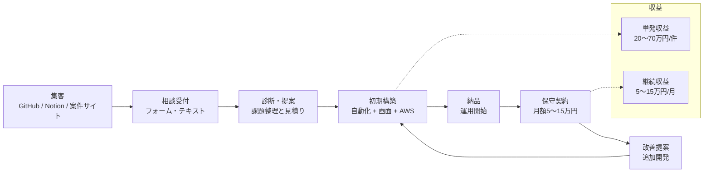

# 個人向け受託ビジネスモデル（自動化 × Web実装 × AWS）

## 1. 提供価値
- 手作業業務を自動化して工数を削減
- Laravel/JSで運用画面を提供し、現場で回る状態を作る
- AWSで安定運用まで面倒を見る

## 2. 収益構造
- 初期構築（単発）
  - ノーコード自動化導入: 20〜35万円
  - 自動化 + 管理画面セット: 40〜70万円
  - AWS軽量運用整備: 15〜30万円
- 継続収益（月額）
  - 保守・監視・軽微改修: 5〜15万円/月

## 3. 売上シミュレーション（月100万円目標）
- 60万円（自動化 + 管理画面）× 1件
- 25万円（AWS整備）× 1件
- 10万円（保守）× 2件

**合計: 105万円 / 月**

## 4. 営業導線（顔出し・通話なし運用）
1. 実績ページ（GitHub + Notion）を公開
2. フォーム経由で相談受付
3. ヒアリングはテキストのみ
4. 提案書テンプレで見積り提示
5. 着手 → 納品 → 保守へ移行

## 5. 図解

Mermaid単体ファイル: `diagram.mmd`
