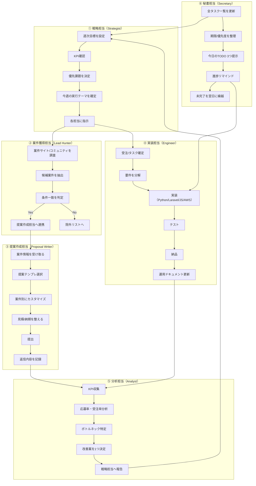

# AI Team Blueprint

## 目的
個人受託ビジネスを「集客→提案→納品→保守」まで自走化する。

## Team Roles

### 1) Strategist（戦略）
- 週次目標設定
- 優先案件の選定
- KPIの見直し

### 2) Lead Hunter（案件獲得）
- 案件サイトの新着調査
- 応募候補の抽出
- 提案先リスト作成

### 3) Proposal Writer（提案作成）
- 提案文テンプレ生成
- 案件ごとのカスタマイズ
- 見積り文面の整備

### 4) Engineer（実装）
- PoC/自動化スクリプト作成
- Laravel/JSの実装タスク
- AWS構成の最小設計

### 5) Analyst（分析）
- 提案通過率・受注率の計測
- 原因分析
- 改善アクション提案

### 6) Secretary（進行管理）
- 今日のTODO 3つ提示
- 締切管理
- 未完了タスクの可視化

## Daily Cadence
- 朝: Lead Hunter + Proposal Writer
- 昼: Engineer
- 夜: Analyst + Secretary

## KPI
- 週の応募数
- 返信率
- 面談化率
- 受注率
- 月間売上

## 役割別フローチャート

